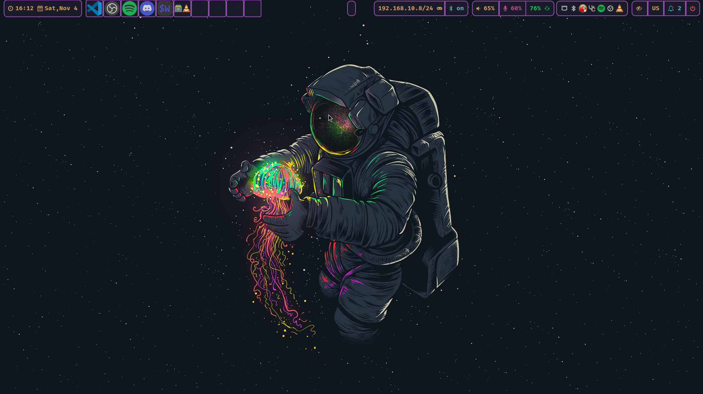

<div align="center">
    <h1>【 Evangelospro's dotfiles 】</h1>
</div>




# ELARCH<a name="top"></a>
1. [How to apply?](#applying)
2. [Dependencies](#dependencies)
3. [Packages](#packages)
4. [Custom Arch Linux ISO with AUR packages batteries included](#custom-arch-linux-iso-with-aur-packages-batteries-included)
5. [Installation and Usage](#installation-and-usage)
6. [Sources / Inspiration](#sources-and-inspiration)

### use chezmoi to apply (all configs except those in confs, which should be installed manually and at your own risk, with knowledge of their according location!) I suggest you fork the repo and make your own changes and examine very carefully, make sure you understand what you are doing before applying anything!<a name="applying"></a>
```
chezmoi init --apply Evangelospro
```

## Dependencies<a name="dependencies"></a>

### Nvidia drivers (try nvidia-open-dkms if supported)
```
sudo pacman -Sy nvidia-dkms nvidia-vaapi-driver-git
```

### Asus (I prefer to always stay latest), hence -git
```
paru -Sy asusctl-git supergfxctl-git
```

### Envy control (Hybrid setups, for asus use supergfxctl)
```
paru -Sy envycontrol
```

### Hyprland
#### Non-Nvidia
```
paru -Sy hyprland-git xdg-desktop-portal-hyprland-git
```
#### Nvidia
```
paru -Sy hyprland-nvidia-git xdg-desktop-portal-hyprland-git
```

### Packages
#### Arch packages listed and organized in
[[packages]](iso/all_packages.x86_64)
#### Python packages
```
pip install -r requirements.txt
```

##### needs to be performed on every vscode update hence aliased the first in .zsh
```
sed -i 's;</head>;<link rel="stylesheet" href="vsc.css"></head>;g' $resPrefix/workbench.html
Fix Checksums: Apply inside vscode run
```

# Custom Arch Linux ISO with AUR packages batteries included
## Setup
```
Desktop Environment: Hyprland
Display Server: Wayland
Window Manager: Hyprland
Display Manager: SDDM
Terminal: Wezterm
Shell: Zsh
```

## Ways to get the ISO
### From the releases tab (automated build)
[](https://github.com/Evangelospro/dotfiles/actions/workflows/buildISO.yml)
#### Oneliner that gets you a ready to use iso
```
curl https://raw.githubusercontent.com/Evangelospro/dotfiles/main/iso/get_iso.sh|bash
ls iso
```
#### Manual download and verification
##### 1) Download all the files from the latest release
##### 2) Verify each part's sha256sum(all should return OK)
```
sha256sum --check *.part*.sha256
```
##### 3) Merge the parts together to get the iso
```
iso_name=$(\ls | grep -E '^ELARCH-*.iso.sha256$' | sed 's/.sha256//')
cat $(\ls | grep -E '^ELARCH-.*\.part[^.]*$') > $iso_name
```
##### #) Verify the combined sha256sum
```
sha256sum --check $iso_name.sha256
```
### Manual Build
```
cd iso
./build.sh
```

## Installation and Usage
get the iso from the iso/isoOUT folder and install it as usual
Default user is `liveuser` and password is `liveuser` sign in with these during the installation process and then run
```
installer
```
in the tty to initialize the dotfile and misc installation process

SDDM should have started and once you login with liveuser you should be greeted with a gorgeous desktop!

A nice calamares installer is also included to guide you through the installation process, in case it didn't start automatically run in a terminal(such as wezterm)
```
sudo calamares -d
```

# 🌟 Stars
- _Consider leaving a star if you liked the project! Thanks!_

[](https://starchart.cc/evangelospro/dotfiles)

### Thanks to these awesome projects <a name="sources-and-inspiration"></a>
* [pipewire](https://archlinux.org/packages/extra/x86_64/pipewire/)
* [playerctl](https://www.archlinux.org/packages/extra/x86_64/playerctl/)
* [blueman](https://archlinux.org/packages/extra/x86_64/blueman/)
* [hyprland](https://aur.archlinux.org/packages/hyprland-git/)
* [swayidle](https://archlinux.org/packages/extra/x86_64/swayidle/)
* [envycontrol](https://github.com/bayasdev/envycontrol)
* [ALCI](https://alci.online/)
