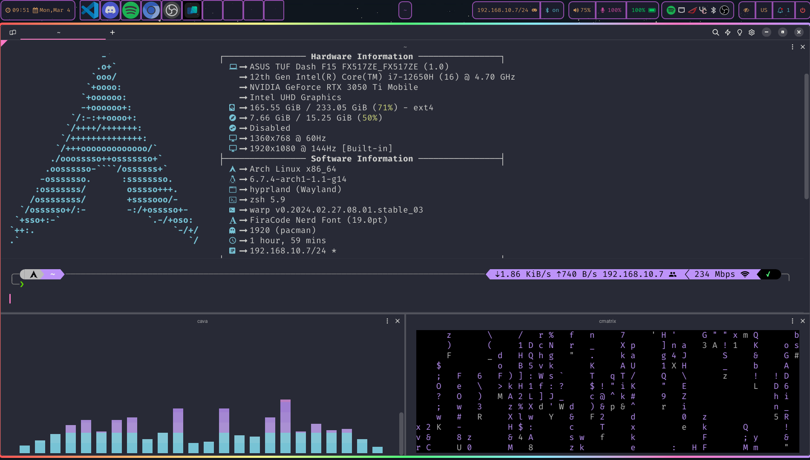

<div align="center">
    <h1>【 Evangelospro's dotfiles 】</h1>
</div>


# ELARCH<a name="top"></a>
## Showcase (may be outdated) <a name="showcase"></a>

https://github.com/Evangelospro/dotfiles/assets/68608623/a00cad72-12a5-4858-8acd-fbfce8b6c3d2



1. [Breakdown](#breakdown)
2. [How to apply?](#applying)
3. [Keybindings](#keybindings)
4. [Linux Setup](#linux-setup)
5. [Contributing](#contributing)
6. [Sources / Inspiration](#sources-and-inspiration)

## Breakdown <a name="breakdown"></a>
There are a few main components to this project:

- [chezmoi](https://www.chezmoi.io/) - Chezmoi takes cares of the dotfiles and the configuration of the system. It is a tool that helps you manage your personal configuration files across multiple machines.
Chezmoi is needed to apply the dotfiles and this repo follows chezmois structure

- [rebos](https://gitlab.com/Oglo12/rebos) - Rebos (Re)(B)uild(Os) is a neat command line tool that essentially adds nix-like reproduction to arch-based systems. It is a tool that helps you manage your system and install packages.
To see the full list of packages that are installed and managed by rebos, you can check the [packages](https://https://github.com/Evangelospro/dotfiles/tree/main/dot_config/rebos)

## My dotfiles can be applied with the below oneliners. BUT `I highly recommend that you fork this repo` and edit the files to your liking before applying them(using your GitHub username). <a name="applying"></a>

In addition please ensure that yourr username is not `evangelospro` as that will copy some of my private files to your system. That are propably useless to you. Furthemore if you want to apply my hacking setup you will need to change every instance of `ELARCH-F15` to your machine's hostname.
```bash
export GITHUB_USERNAME=Evangelospro
curl --silent https://raw.githubusercontent.com/$GITHUB_USERNAME/dotfiles/main/install.sh|bash
```

## Keybindings

### Hyprland

| Keybinding  | Action        |
| ----------- | ------------- |
| Windows + M | Exit Hyprland |

### Launch / Reload Applications

| Keybinding          | Action                                            |
| ------------------- | ------------------------------------------------- |
| Windows + Enter     | Launch Terminal                                   |
| Windows + L         | Lock Screen(swaylock)                             |
| Windows + Space     | Launch launcher(anyrun)                           |
| Windows + V         | Open clipboard manager (wl-clipboard)             |
| Windows + C         | Select color from screen (hyprpicker) and copy it |
| Windows + E         | Open file manager(Nemo)                           |
| Windows + R         | Resize window with slurp                          |
| Windows + Shift + R | Reload the bar on top (waybar)                    |

### Close / Fullscreen / Kill Applications / Arrange monitors

| Keybinding          | Action                                                |
| ------------------- | ----------------------------------------------------- |
| ALT + F4            | Close focused window                                  |
| CTRL + SHIFT + ESC  | Kill window clicked on (xkill or windows taskmanager) |
| Windows + F         | Toggle fullscreen on focused window                   |
| Windows + Shift + F | Toggle floating on focused window                     |
| Windows + P         | Arrange monitors (extend / duplicate)                 |

### Screenshot / OCR

| Keybinding  | Action                                     |
| ----------- | ------------------------------------------ |
| prtsc       | Take screenshot interactively (flameshot)  |
| Windows + O | Copy text from screen with OCR (tesseract) |

### Move focus between windows in the current workspace

| Keybinding           | Action                                       |
| -------------------- | -------------------------------------------- |
| Windows + AWSD | Move focus to the direction of the arrow key |

### Rearrange windows in the current workspace

| Keybinding     | Action                                                |
| -------------- | ----------------------------------------------------- |
| Windows + Arrow keys | Move focused window to the direction of the AWSD keys |

### Move Windows Between Monitors

| Keybinding                   | Action                                                               |
| ---------------------------- | -------------------------------------------------------------------- |
| Windows + SHIFT + Arrow keys | Move focused window to the monitor in the direction of the arrow key |

### Move Windows Between Workspaces

| Keybinding            | Action                                                       |
| --------------------- | ------------------------------------------------------------ |
| Windows + SHIFT + 1-9 | Move focused window to the workspace with the number pressed |
| Windows + 1-9         | Move to the workspace with the number pressed                |

### Cycle through workspaces

| Keybinding            | Action                            |
| --------------------- | --------------------------------- |
| Windows + TAB         | Cycle through workspaces forward  |
| Windows + SHIFT + TAB | Cycle through workspaces backward |

### Move window with mouse

| Keybinding               | Action                 |
| ------------------------ | ---------------------- |
| Windows + Click and drag | Move window with mouse |


## Linux Setup

### OS: [Arch Linux](https://archlinux.org/)

### Kernel: [Linux-zen](https://archlinux.org/packages/?name=linux-zen)

### Display Server: [Wayland](https://wiki.archlinux.org/title/Wayland)

### Window Manager: [Hyprland](https://wiki.hyprland.org)

### Terminal: [Warp](https://warp.dev)

### Shell [ZSH](https://wiki.archlinux.org/title/Zsh)

#### Bindings: [binds.zsh](dot_config/zsh/executable_binds.zsh)

#### Aliases: [aliases.zsh](dot_config/zsh/executable_aliases.zsh)

#### Functions: [functions.zsh](dot_config/zsh/executable_functions.zsh)

#### Plugin Manager: [Zinit](https://github.com/zdharma-continuum/zinit)

#### [Plugins config](dot_config/zsh/executable_plugins.zsh)

#### Theme: [Powerlevel10k](https://github.com/romkatv/powerlevel10k)

#### Font: [FiraCode Nerd Font](https://www.nerdfonts.com/font-downloads)

#### Color Scheme: [Dracula](https://draculatheme.com)

## Development Setup

### [Docker-rootless](https://docs.docker.com/engine/security/rootless)

### [Visual Studio Code Insiders](https://code.visualstudio.com/insiders/)
- [configuration](dot_config/private_Code%20-%20Insiders)

## Hacking Setup

### Shell functions

| Function              | Action                                                                  |
| --------------------- | ----------------------------------------------------------------------- |
| update-burp           | Update burp to the latest version                                       |
| angr                  | Run angr in a docker container                                          |
| extract-base64-string | Extract base64 encoded strings from a file                              |
| extract-urls          | Extract urls from a file                                                |
| frida-init            | Initialize frida server on android device                               |
| frida-kill            | Kill frida server on android device                                     |
| pwnenv                | Create a pwn environment in a docker container                          |
| pwnsetup              | Setup a pwn template in the current directory                           |
| scan                  | Use rustscan to scan a host                                             |
| curl                  | Normal curl but uses the burp proxy if it's running                     |
| ferox-\*              | Feroxbust a host with a specific wordlist                               |
| ffuf-\*               | Fuzz a host with a specific wordlist                                    |
| getWordlist           | Return a wordlist of either dns or dir according to the argument passed |

### Burp

#### Installation and updates

Burp is setup to auto update with the update zsh function above. As I like to use the jar file with my own loaders for obvious reasons, the latest jar file is fetched and placed in $HOME/.config/Burp/Burp-Loader and symlinked to burpsuite_pro.jar

#### Config

-   [project-options.json](dot_config/Burp/project-options.json)
-   [user-options.json](dot_config/Burp/user-options.json)

### IDA [DockerWineIDA](https://github.com/NyaMisty/docker-wine-ida)

IDA essentially runs in docker(running xfce and wine) and rdesktop auto connects
It can be started via the IDA [desktop file](dot_local/private_share/private_applications/ida.desktop.tmpl) it can be launched from the launcher

### Android Emulator

A setup android emulator can be started from the launcher using the [android_emulator](dot_local/private_share/private_applications/android-emulator.desktop) desktop file

## Contributing

### Bug Reports, Feature Requests and questions

-   Please use the [issue tracker](https://github.com/evangelospro/dotfiles/issues) to report any bugs, file feature requests or ask questions.

### Pull Requests

-   Feel free to fork and contribute to this project. If you feel like you can add something to it or fix a bug, go for it.
-   If you want to contribute to the project, please open a pull request.
-   If you want to add a new feature, please create an issue first to discuss if it is a good idea or not.
-   If you want to fix a bug, please also create an issue first.

## 🌟 Stars 🌟

-   _Consider leaving a star if you liked the project! Thanks!_

[](https://starchart.cc/evangelospro/dotfiles)

## Thanks to these awesome projects and many more!!! <a name="sources-and-inspiration"></a>

-   [Chezmoi](https://www.chezmoi.io/)
-   [Rebos](https://gitlab.com/Oglo12/rebos)

-   [Arch Linux](https://archlinux.org/)
-   [Hyprland](https://github.com/hyprwm/Hyprland)
-   [hypridle](https://github.com/hyprwm/hypridle)
-   [SwayNotificationCenter](https://github.com/ErikReider/SwayNotificationCenter)
-   [Waybar](https://github.com/alexays/waybar/)
-   [Lsd](https://github.com/lsd-rs/lsd)
-   [playerctl](https://github.com/altdesktop/playerctl/)
-   [Asusctl](https://gitlab.com/asus-linux/asusctl/)
-   [swaylock-effects](https://github.com/mortie/swaylock-effects/)
