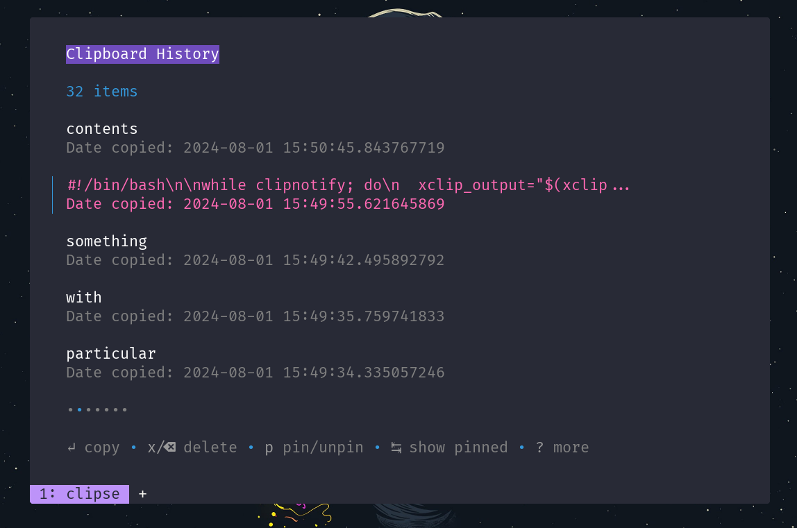

<div align="center">
    <h1>【 Evangelospro's dotfiles 】</h1>
</div>


# ELARCH ((E)vangelos (L)ioudakis (ARCH))

## Showcase (may be outdated)

<details open align="center"> <summary>Hyprland</summary>
<div align="center">
<video src ="https://github.com/Evangelospro/dotfiles/assets/68608623/a00cad72-12a5-4858-8acd-fbfce8b6c3d2" width="320" height="200" controls preload></video>


</div>
</details>
<br clear="both"/>

## Breakdown

There are a few main components to this project:

-   [chezmoi](https://www.chezmoi.io/) - Chezmoi takes cares of the dotfiles and the configuration of the system. It is a tool that helps you manage your personal configuration files across multiple machines.
    Chezmoi is needed to apply the dotfiles and this repo follows chezmois structure

-   [rebos](https://gitlab.com/Oglo12/rebos) - Rebos (Re)(B)uild(Os) is a neat command line tool that essentially adds nix-like reproduction to arch-based systems. It is a tool that helps you manage your system and install packages.
    To see the full list of packages that are installed and managed by rebos, you can check the [packages](https://github.com/Evangelospro/dotfiles/tree/main/dot_config/rebos)

## How to apply

> [!WARNING]
> I highly recommend that you [use it as template](https://github.com/evangelospro/dotfiles/generate) and edit the files to your liking before applying them (using your own GitHub username)

### Cloning

```bash
$GITHUB_USERNAME=Evangelospro # preferably change this to your own template and github username
git clone https://github.com/$GITHUB_USERNAME/dotfiles ~/.local/share/chezmoi
```

### Basic configuration

> [!IMPORTANT]
> Open up your local[.chezmoi.jsonc.tmpl](.chezmoi.jsonc.tmpl) and edit all aplicable fields:

> [!WARNING]
> The below are a must to change, if you don't change them, you will probably not get what you want and have to spend a lot of time troubleshooting!

-   isPersonal: This is kind of a setting you have to change or else you will receive some configurations that I deemed too personal, if I deemed that, then they will probably install some personal packages or configurations that you might not want
-   isHeadless: This is whether the machine is running headless(No GUI) or not(e.g. a server), this is used to determine whether to install GUI packages or not
-   isLaptop: This is whether the machine is a laptop or not, this is used to determine whether to install laptop specific packages or not
-   isHacking: Personally, I like to play a lot of [CTFs](https://evangelospro.com/posts/?tags=ctfs)(capture the flag competitions), so I have A LOT of hacking tools installed for all the occasions, if you are not into that, you can set this to false, or at least check the [hacking setup](#hacking-setup) section to see if you want to install those tools or not.
-   isAsus: This is whether the machine has Asus hardware or not, this is used to determine whether to install Asus specific packages or not(e.g. asusctl, rog-control-center ...)

#### Graphics (If hybrid graphics, set both to true)

-   isNvidiaGPU: This is whether the machine has Nvidia hardware or not, this is used to determine whether to install Nvidia specific packages or not(e.g. nvidia drivers, cuda...)
-   isAmdGPU: This is whether the machine has AMD gpu or not, this is used to determine whether to install AMD specific packages or not(e.g. amdgpu drivers...)
-   isIntelGPU: This is whether the machine has Intel gpu or not, this is used to determine whether to install Intel specific packages or not(e.g. intel gpu drivers...)

### Applying

```bash
bash install.sh
```

## Keybindings

#### Modifiers

$MOD = SUPER

### Hyprland

| Keybinding       | Action                              |
| ---------------- | ----------------------------------- |
| $MOD + M         | Exit Hyprland                       |
| $MOD + Shift + R | Reload the window manager(hyprland) |

### Launch / Reload Applications

| Keybinding   | Action                                            |
| ------------ | ------------------------------------------------- |
| $MOD + T     | Launch Terminal                                   |
| $MOD + L     | Lock Screen (swaylock)                            |
| $MOD + Space | Launch launcher (walker)                          |
| $MOD + V     | Open clipboard manager (clipse)                   |
| $MOD + C     | Select color from screen (hyprpicker) and copy it |
| $MOD + E     | Open file manager (Nemo)                          |
| $MOD + R     | Resize window with slurp                          |

### Close / Fullscreen / Kill Applications / Arrange monitors

| Keybinding         | Action                                                                   |
| ------------------ | ------------------------------------------------------------------------ |
| ALT + F4           | Close focused window                                                     |
| CTRL + SHIFT + ESC | Kill window clicked on (xkill or windows taskmanager like functionality) |
| $MOD + F           | Toggle fullscreen on focused window                                      |
| $MOD + Shift + F   | Toggle floating on focused window                                        |
| $MOD + P           | Arrange monitors (extend / duplicate)                                    |

### Screenshot / OCR

| Keybinding | Action                                     |
| ---------- | ------------------------------------------ |
| prtsc      | Take screenshot interactively (flameshot)  |
| $MOD + O   | Copy text from screen with OCR (tesseract) |

### Move focus between windows in the current workspace

| Keybinding  | Action                                       |
| ----------- | -------------------------------------------- |
| $MOD + AWSD | Move focus to the direction of the AWSD keys |

### Rearrange windows in the current workspace

| Keybinding        | Action                                                 |
| ----------------- | ------------------------------------------------------ |
| $MOD + Arrow keys | Move focused window to the direction of the arrow keys |

### Move Windows Between Monitors

| Keybinding                | Action                                                               |
| ------------------------- | -------------------------------------------------------------------- |
| $MOD + SHIFT + Arrow keys | Move focused window to the monitor in the direction of the arrow key |

### Move Windows Between Workspaces

| Keybinding         | Action                                                       |
| ------------------ | ------------------------------------------------------------ |
| $MOD + SHIFT + 1-9 | Move focused window to the workspace with the number pressed |
| $MOD + 1-9         | Move to the workspace with the number pressed                |

### Cycle through workspaces

| Keybinding         | Action                            |
| ------------------ | --------------------------------- |
| $MOD + TAB         | Cycle through workspaces forward  |
| $MOD + SHIFT + TAB | Cycle through workspaces backward |

### Move window with mouse

| Keybinding            | Action                                                    |
| --------------------- | --------------------------------------------------------- |
| $MOD + Click and drag | Move window with mouse(you can even move across monitors) |

## Linux Setup

### System:

#### OS: [Arch Linux](https://archlinux.org/)

#### Kernel: [Linux-g14](https://archlinux.org/packages/?name=linux-g14) and fallback to [Linux](https://archlinux.org/packages/?name=linux)

#### Display Server: [Wayland](https://wiki.archlinux.org/title/Wayland)

### GUI:

#### Color Scheme: [Dracula](https://draculatheme.com)

#### Notification Center: [SwayNotificationCenter](https://github.com/ErikReider/SwayNotificationCenter)

-   [configuration](dot_config/swaync)
    
    

#### Window Manager: [Hyprland](https://wiki.hyprland.org)

#### Bar: [Waybar](https://github.com/Alexays/Waybar)

-   [configuration](dot_config/waybar)
    

#### Application Launcher: [Walker](https://github.com/abenz1267/walker)

-   [configuration](dot_config/walker)
    

#### Clipboard Managegment: [wl-clipboard](https://github.com/bugaevc/wl-clipboard)

-   [clipboard manager](dot_local/bin/executable_clip-menu) - A dmenu based clipboard manager that uses wl-clipboard and fuzzy finding to paste from clipboard history
    

#### Color Picker: [Hyprpicker](https://wiki.hyprland.org)

#### OSD: [swayosd](https://github.com/ErikReider/SwayOSD) - An on-screen display for capslock, numlock, volume, brightness and more

!

### Terminal and Shell:

### Terminal: [Warp](https://warp.dev)

### Shell [ZSH](https://wiki.archlinux.org/title/Zsh)

#### Theme: [Powerlevel10k](https://github.com/romkatv/powerlevel10k)

#### Font: [FiraCode Nerd Font](https://www.nerdfonts.com/font-downloads)

#### Bindings: [binds.zsh](dot_config/zsh/executable_binds.zsh)

#### Aliases: [aliases.sh](dot_config/shell/executable_aliases.sh)

#### Functions: [functions.zsh](dot_config/zsh/executable_functions.zsh)

#### Plugins:

##### [manager](https://github.com/zdharma-continuum/zinit)

##### [config](dot_config/zsh/executable_plugins.zsh.tmpl)

###### [zsh-smartcache](https://github.com/QuarticCat/zsh-smartcache) - Caches the output of commands such as $(eval program init) to speed up shell startup

###### [thefuck](https://github.com/nvbn/thefuck) - a magnificent app, that corrects errors in previous console commands.

###### [direnv](https://direnv.net/) - It can load and unload environment variables depending on the current directory. (usually loads an adjacent .env from your local directory)

###### [atuin](https://atuin.sh/) - Stores shell history and allows you to search it with fuzzy finding and very quick shortcuts, significantly speeding up the proccess of you finding that one command that you typed a year ago.

###### [highlighter](https://github.com/Ga0aG/hhighlighter) - Essentially it allows you to highlight output of commands in the terminal (e.g echo "evangelospro" | h "pro")

###### [dirhistory](https://github.com/ohmyzsh/ohmyzsh/blob/master/plugins/dirhistory/dirhistory.plugin.zsh) - Navigate directory history using ALT-LEFT and ALT-RIGHT

###### [zoxide](https://github.com/z-shell/zsh-zoxide) - A smarter `cd` command that remember and adjusts to your habbits allowing you to navigate directories faster

###### [zsh-mask](https://github.com/jgogstad/zsh-mask) - Masks secrets in your zsh history, so you don't accidentally leak them

###### [zsh-autopair](https://github.com/hlissner/zsh-autopair) - A zsh plugin that automatically inserts closing brackets, parens, quotes, etc.

###### [zsh-navi](https://github.com/icatalina/zsh-navi-plugin) - A zsh plugin for [navi](https://github.com/denisidoro/navi) - An interactive cheatsheet tool for the command-line

###### [zsh-you-should-use](https://github.com/MichaelAquilina/zsh-you-should-use) - Simple zsh plugin that reminds you that you should use one of your existing aliases for a command you just typed.

###### [zsh-auto-notify](https://github.com/MichaelAquilina/zsh-auto-notify) - ⏰ ZSH plugin that automatically sends out a notification when a long running task has completed.

###### [zsh-autosuggestions](https://github.com/zsh-users/zsh-autosuggestions) - Suggests commands as you type based on history and completions

###### [zsh-syntax-highlighting](https://github.com/zsh-users/zsh-syntax-highlighting) - Highlights commands as you type based on syntax

###### [zsh-completions](https://github.com/zsh-users/zsh-completions) - Additional completion definitions for zsh

###### [zsh-autocomplete](https://github.com/marlonrichert/zsh-autocomplete) - A fast, asynchronous autocomplete plugin for Zsh

###### [zsh-autosuggestions](https://github.com/zsh-users/zsh-autosuggestions) - Fish-like autosuggestions for zsh

###### [modern-unix-commands](https://github.com/ibraheemdev/modern-unix) - Essentially replaces many well known unix commands and utilities with better or superior alternatives

-   [lsd](https://github.com/lsd-rs/lsd) - This project is a rewrite of GNU ls with lots of added features like colors, icons, tree-view, more formatting options etc...
-   [bat](https://github.com/sharkdp/bat) - A cat(1) clone with wings. With syntax highlighting and many more features while being a cat(1) drop in replacement
-   [format](https://github.com/eth-p/bat-extras) - A collection of additional utilities for bat(1) like prettyprinting / formatting with `format`
-   [rigprep](https://github.com/BurntSushi/ripgrep) - ripgrep recursively searches directories for a regex pattern while respecting your gitignore (aliased to `rg` and boosted by `batgrep` for syntax highlighting)
-   [fd](https://github.com/sharkdp/fd) - A simple, fast and user-friendly alternative to 'find'
-   [procs](https://github.com/dalance/procs) - A modern replacement for ps written in Rust
-   [hyperfine](https://github.com/sharkdp/hyperfine) - A command-line benchmarking tool.
-   [btm](https://github.com/ClementTsang/bottom) - A cross-platform graphical process/system monitor with a customizable interface and a multitude of features (aliased to `top`)
-   [tealdeer](https://github.com/dbrgn/tealdeer) - A collection of simplified, example based and community-driven man pages. (aliased to `tldr` or `help`)
-   [dust](https://github.com/bootandy/dust) - A more intuitive version of du written in Rust (aliased to `du`)
-   [delta](https://github.com/dandavison/delta) - A viewer for git and diff output (aliased to `diff`)

#### Theme: [Powerlevel10k](https://github.com/romkatv/powerlevel10k)

-   [configuration](dot_config/zsh/executable_p10k.zsh)

## Development Setup

### [Docker-rootless](https://docs.docker.com/engine/security/rootless)

### [Visual-Studio-Code-Insiders](https://code.visualstudio.com/insiders)

-   [configuration](dot_config/private_Code%20-%20Insiders)

## Windows Setup (Mostly manual)

On windows I use GlazeWM with the Win key remapped using [PowerToys](https://learn.microsoft.com/en-us/windows/powertoys/install)

```powershell
winget install Microsoft.PowerToys --source winget
```

SO
WIN -> ALT
ALT -> WIN

## Hacking Utilities and Setup

### Shell functions

| Function       | Action                                                                  |
| -------------- | ----------------------------------------------------------------------- |
| update-burp    | Update burp to the latest version                                       |
| angr           | Run angr in a docker container                                          |
| extract-base64 | Extract base64 encoded strings from a file                              |
| extract-urls   | Extract urls from a file                                                |
| frida-init     | Initialize frida server on android device                               |
| frida-kill     | Kill frida server on android device                                     |
| pwnenv         | Create a pwn environment in a docker container                          |
| pwnsetup       | Setup a pwn template in the current directory                           |
| scan           | Use rustscan to scan a host                                             |
| curl           | Normal curl but uses the burp proxy if it's running                     |
| ferox-\*       | Feroxbust a host with a specific wordlist                               |
| ffuf-\*        | Fuzz a host with a specific wordlist                                    |
| getWordlist    | Return a wordlist of either dns or dir according to the argument passed |

### Burp

#### Installation and updates

Burp is setup to auto update with the update zsh function above. As I like to use the jar file with my own loaders for obvious reasons, the latest jar file is fetched and placed in $HOME/.config/Burp/Burp-Loader and symlinked to burpsuite_pro.jar

#### Config

-   [project-options.json](dot_config/Burp/project-options.json)
-   [user-options.json](dot_config/Burp/user-options.json)

### Android Emulator

An already setup android emulator can be started from the launcher using the [android_emulator](dot_local/private_share/private_applications/android-emulator.desktop) desktop file

## Contributing

### Bug Reports, Feature Requests and questions

-   Please use the [issue tracker](https://github.com/evangelospro/dotfiles/issues) to report any bugs, file feature requests or ask questions.

### Pull Requests

-   Feel free to fork and contribute to this project. If you feel like you can add something to it or fix a bug, go for it.
-   If you want to contribute to the project, please open a pull request.
-   If you want to add a new feature, please create an issue first to discuss if it is a good idea or not.
-   If you want to fix a bug, please also create an issue first.

## 🌟 Stars 🌟

-   _Consider leaving a star if you liked the project! Thanks!_

[](https://starchart.cc/evangelospro/dotfiles)

## Thanks to these awesome projects and many more!!!

-   [Chezmoi](https://www.chezmoi.io/)
-   [Rebos](https://gitlab.com/Oglo12/rebos)

-   [Arch Linux](https://archlinux.org/)
-   [Hyprland](https://github.com/hyprwm/Hyprland)
-   [hypridle](https://github.com/hyprwm/hypridle)
-   [SwayNotificationCenter](https://github.com/ErikReider/SwayNotificationCenter)
-   [Waybar](https://github.com/alexays/waybar/)
-   [Lsd](https://github.com/lsd-rs/lsd)
-   [playerctl](https://github.com/altdesktop/playerctl/)
-   [Asusctl](https://gitlab.com/asus-linux/asusctl/)
-   [swaylock-effects](https://github.com/mortie/swaylock-effects/)
